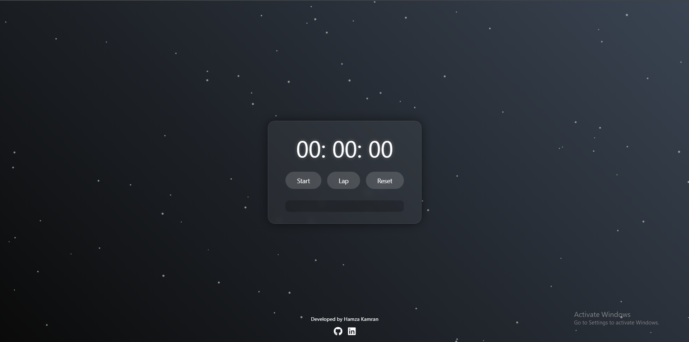

# Modern Stopwatch Application

A sleek and modern stopwatch application built with HTML, CSS, and JavaScript. This application features a beautiful particle background, smooth animations, and a clean user interface.

 

## Features

- **Particle Background**: Dynamic floating particles create a mesmerizing background effect.
- **Glassmorphism Design**: Modern UI with blurred glass-like elements.
- **Smooth Animations**: Buttons and digits animate smoothly for a polished experience.
- **Lap Functionality**: Track and display lap times with ease.
- **Millisecond Precision**: Accurate timing down to the millisecond.
- **Responsive Design**: Works seamlessly on all screen sizes.
- **Ripple Effect**: Beautiful ripple animation on button clicks.
- **Digit Animation**: Digits scale and glow when updated.
- **Developer Footer**: Includes developer name and social media links.

## Live Demo

## How to Use

1. **Start/Stop**: Click the "Start" button to begin timing. Click "Stop" to pause.
2. **Lap**: Click the "Lap" button to record the current time while the stopwatch is running.
3. **Reset**: Click the "Reset" button to clear the timer and lap list.

## File Structure
stopwatch/
├── index.html # Main HTML file
├── style.css # Stylesheet for the application
├── script.js # JavaScript for functionality and animations
└── README.md # This documentation file

## Customization

- **Particle Count**: Adjust the number of particles by modifying the `initParticles()` function in `script.js`.
- **Colors**: Change the background gradient and particle colors in `style.css`.
- **Animation Speed**: Modify the `animateParticles()` function in `script.js` to adjust particle movement speed.

## Technologies Used

- HTML5
- CSS3 (with animations and transitions)
- JavaScript (ES6+)
- Canvas API (for particle background)
- Font Awesome (for social media icons)

## Browser Support

The stopwatch application is compatible with all modern web browsers, including:
- Google Chrome
- Mozilla Firefox
- Microsoft Edge
- Safari

## Developer

Developed by **Hamza Kamran**  
- [GitHub](https://github.com/haider14-9abbaas)
- [LinkedIn](https://www.linkedin.com/in/syed-haider-abbas-zaidi-132525215/)

## License

This project is licensed under the MIT License. See the [LICENSE](./Syed Haider Abbas Zaidi) file for details.
